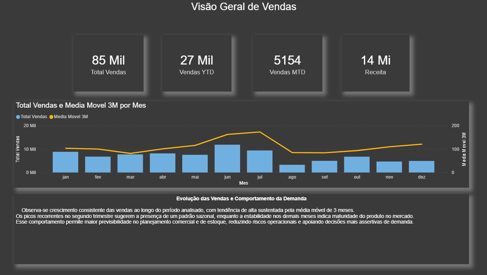

# Retail Sales Forecasting & Inventory Analysis | Power BI

## 🇧🇷 Visão Geral do Projeto

Este projeto tem como objetivo analisar o comportamento das vendas, identificar padrões de sazonalidade e avaliar a eficiência do estoque ao longo do tempo, utilizando o Power BI como principal ferramenta de análise e visualização de dados.

O dashboard foi desenvolvido com foco em tomada de decisão, apresentando métricas claras, insights acionáveis e uma abordagem visual corporativa.

---

## 🎯 Objetivos da Análise

- Avaliar a evolução das vendas ao longo do tempo
- Identificar padrões sazonais de demanda
- Analisar a relação entre vendas e nível de estoque
- Avaliar a cobertura de estoque e eficiência operacional
- Apoiar decisões de planejamento e gestão de estoque

---

## 📊 Estrutura do Dashboard

### 🔹 Visão Geral

- Evolução das vendas mensais
- Média móvel de 3 meses
- Indicadores de desempenho (Vendas, Receita)
- Insight sobre tendência e estabilidade da demanda

### 🔹 Sazonalidade de Vendas

- Comparação mensal de vendas por ano
- Padrão sazonal médio (ajustado para evitar viés de dados incompletos)
- Análise de comportamento recorrente ao longo do ano

### 🔹 Gestão de Estoque

- Evolução do estoque ao longo do tempo
- Relação entre vendas e nível de estoque (análise focada em 2016)
- Indicadores de estoque atual, média de estoque e cobertura de estoque
- Insight sobre eficiência e riscos operacionais

---

## 🛠️ Ferramentas Utilizadas

- Power BI
- DAX (Data Analysis Expressions)
- Modelagem de dados
- Análise temporal e sazonalidade

---

## 📁 Arquivos do Projeto

- `dashboard/` → Arquivo Power BI (.pbix)
- `images/` → Prints das páginas do dashboard
- `data/` → Base de dados utilizada (quando aplicável)

---

## 📌 Observações Importantes

- O padrão sazonal foi calculado considerando apenas meses com dados completos para evitar distorções.
- A análise de estoque foi segmentada para garantir coerência temporal entre vendas e estoque.
- O projeto foi desenvolvido com foco em clareza, consistência e boas práticas de BI.

---

## 👤 Autor

Marcelo Nepomuceno  
Engenharia de Produção | Business Intelligence | Data Analytics  

LinkedIn: *(adicione aqui seu link)*

---

---

## 🇺🇸 Project Overview

This project aims to analyze sales behavior, identify seasonality patterns, and evaluate inventory efficiency over time using Power BI as the main analytics and visualization tool.

The dashboard was designed with a decision-making focus, delivering clear KPIs, actionable insights, and a corporate visual standard.

---

## 🎯 Analysis Objectives

- Analyze sales trends over time
- Identify seasonal demand patterns
- Evaluate the relationship between sales and inventory levels
- Assess inventory coverage and operational efficiency
- Support planning and inventory management decisions

---

## 📊 Dashboard Structure

### 🔹 Overview
- Monthly sales evolution
- 3-month moving average
- Performance indicators (Sales, Revenue)
- Insight on demand trend and stability

### 🔹 Sales Seasonality
- Monthly sales comparison by year
- Average seasonal pattern (adjusted to avoid incomplete data bias)
- Analysis of recurring demand behavior

### 🔹 Inventory Management
- Inventory evolution over time
- Relationship between sales and inventory levels (focused on 2016)
- KPIs: current stock, average stock, stock coverage
- Insight on efficiency and operational risks

---

## 🛠️ Tools & Technologies

- Power BI
- DAX
- Data modeling
- Time series and seasonality analysis

---

## 📁 Project Files

- `dashboard/` → Power BI file (.pbix)
- `images/` → Dashboard screenshots
- `data/` → Dataset (if applicable)

---

## 👤 Author

Marcelo Nepomuceno  
Production Engineering | Business Intelligence | Data Analytics  

